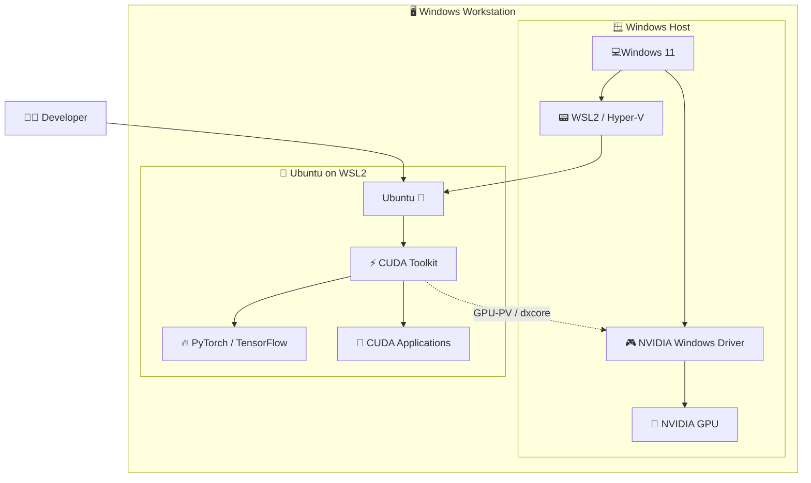

# Unparallel Parallelism

A hands-on workshop exploring parallel computing with CUDA and GPUs — from "what is a thread?" to making thousands of them work (or misbehave).

> **Disclaimer:** No GPUs were harmed in the making of this workshop. Any kernel panics are purely educational.


### 💡 How It Works

WSL2 runs a lightweight Linux VM using Microsoft's hypervisor (Hyper-V). NVIDIA's GPU-PV (GPU Paravirtualization) technology allows this VM to talk directly to the physical GPU through a special user-mode driver (`libdxcore.dll` on Windows ↔ `libdxcore.so` inside WSL). The CUDA toolkit routes compute calls through this bridge, giving near-native GPU performance — typically within 5% of bare metal.




---

## 📁 Folder Structure

```
unparallel-parallelism/
    │
    ├── README.md                    # This file
    ├── CMakeLists.txt               # Build configuration
    ├── .clang-format                # C++/CUDA formatting rules
    │
    ├── scripts/                     # Setup scripts
    │    └── run_me_first.sh         # One-shot environment setup
    │
    ├── src/                         # Source code
    │    ├── cuda/
    │    │    └── vector_add.cu      # CUDA vector addition example
    │    └── cpp/
    │         └── main.cpp
    │
    ├── test/                        # Tests
    │    └── cpp/
    │         └── test_main.cpp
    │
    └── go/                          # Go examples
```

---

## 💻 Setup — CUDA on Windows via WSL2

Run GPU-accelerated workloads natively inside Linux on your Windows machine — no dual-boot required. As of 2021, NVIDIA officially supports CUDA inside WSL2.

### What You'll Need

- Windows 10 (version 21H2 or later) or Windows 11
- An NVIDIA GPU (Maxwell / GTX 900 series or newer)
- At least 8 GB RAM (16 GB recommended for ML workloads)
- ~15 GB free disk space

> CUDA via WSL2 does **not** support AMD or Intel GPUs. This guide is NVIDIA-only.

---

### Step 1 — 🎮 Install the NVIDIA Windows Driver (Host Side - on Windows) 

**Install the GPU driver on Windows, not inside WSL.** WSL2 shares the Windows GPU driver through a translation layer — installing a Linux driver inside WSL will break things.

1. Go to [https://www.nvidia.com/Download/index.aspx](https://www.nvidia.com/Download/index.aspx)
2. Select your GPU model, Windows 10/11, and the latest Game Ready or Studio driver
3. Install it on Windows as normal

After installation, verify the driver is visible from PowerShell:

```powershell
nvidia-smi
```

You should see your GPU listed with the driver version. If `nvidia-smi` works on Windows, you're ready to move inside WSL.

### Step 2 — 🐧 Setup Ubuntu with WSL2

Open **PowerShell as Administrator**:

```powershell
wsl --install
```

This installs WSL2 and Ubuntu in one shot on Windows 10 21H2+ and Windows 11. Restart when prompted.

Install **Ubuntu Destro** and set it default

```powershell
wsl --set-default Ubuntu-22.04
wsl
```

If you already have WSL1 installed:

```powershell
wsl --set-default-version 2
wsl --set-version Ubuntu 2
```

Verify WSL2 is active:

```powershell
wsl -l -v
```

**Output:**
You should see `VERSION 2` next to your distro.

```powershell
    
    NAME                   STATE           VERSION
    *   Ubuntu-22.04       Running         2
```


---

### Step 3 — ⚙️ Update Your WSL2 Ubuntu Environment

```powershell
wsl -d Ubuntu-22.04
```

Update the package list:

```bash
sudo apt update && sudo apt upgrade -y
```

---

### Step 4 — 📟 Install the CUDA Toolkit Inside WSL

Use NVIDIA's **WSL-Ubuntu** specific CUDA packages — not the standard Linux ones. These skip installing the GPU driver (since it lives on the Windows side).

```bash
# Add the WSL-Ubuntu CUDA keyring
wget https://developer.download.nvidia.com/compute/cuda/repos/wsl-ubuntu/x86_64/cuda-keyring_1.1-1_all.deb
sudo dpkg -i cuda-keyring_1.1-1_all.deb

# Update and install CUDA toolkit
sudo apt update
sudo apt install -y cuda-toolkit-12-4
```

> Use `cuda-toolkit`, not `cuda`. The `cuda` meta-package includes the driver — the `cuda-toolkit` package is driver-free, which is what WSL needs.

Add CUDA to your PATH:

```bash
echo 'export PATH=/usr/local/cuda/bin:$PATH' >> ~/.bashrc
echo 'export LD_LIBRARY_PATH=/usr/local/cuda/lib64:$LD_LIBRARY_PATH' >> ~/.bashrc
source ~/.bashrc
```

---

### Step 5 — 📋 Verify the Installation

Check the NVIDIA CUDA compiler:

```bash
nvcc --version
```

Expected output:

```
nvcc: NVIDIA (R) Cuda compiler driver
Cuda compilation tools, release 12.4, V12.4.xx
```

Verify GPU access from inside WSL:

```bash
nvidia-smi
```

You should see the same GPU listed here as from Windows PowerShell.

```bash
+-----------------------------------------------------------------------------------------+
| NVIDIA-SMI 595.45.03              Driver Version: 595.71         CUDA Version: 13.2     |
+-----------------------------------------+------------------------+----------------------+
| GPU  Name                 Persistence-M | Bus-Id          Disp.A | Volatile Uncorr. ECC |
| Fan  Temp   Perf          Pwr:Usage/Cap |           Memory-Usage | GPU-Util  Compute M. |
|                                         |                        |               MIG M. |
|=========================================+========================+======================|
|   0  NVIDIA GeForce RTX 4060        On  |   00000000:03:00.0  On |                  N/A |
|  0%   46C    P5            N/A  /  115W |    1280MiB /   8188MiB |      7%      Default |
|                                         |                        |                  N/A |
+-----------------------------------------+------------------------+----------------------+

+-----------------------------------------------------------------------------------------+
| Processes:                                                                              |
|  GPU   GI   CI              PID   Type   Process name                        GPU Memory |
|        ID   ID                                                               Usage      |
|=========================================================================================|
|  No running processes found                                                             |
```

---

### Step 6 — ▶️ Run Your First CUDA Program

```bash
cat > hello.cu << 'EOF'
#include <stdio.h>

__global__ void helloFromGPU() {
    printf("Hello from GPU thread %d, block %d!\n", threadIdx.x, blockIdx.x);
}

int main() {
    printf("Launching kernel...\n");
    helloFromGPU<<<2, 4>>>();
    cudaDeviceSynchronize();
    printf("Done.\n");
    return 0;
}
EOF

nvcc hello.cu -o hello
./hello
```

Expected output:

```
Launching kernel...
Hello from GPU thread 0, block 0!
Hello from GPU thread 1, block 0!
...
Done.
```

If you see output from multiple threads — your GPU is fully operational inside WSL2.

> ### Congragulations! Now you can build CUDA Apps 🏆


---

### Bonus: Install cuDNN

For PyTorch, TensorFlow, or JAX workloads:

```bash
sudo apt install -y libcudnn9-cuda-12
dpkg -l | grep cudnn
```

### Bonus: Install PyTorch with CUDA Support

```bash
pip install torch torchvision torchaudio --index-url https://download.pytorch.org/whl/cu124
```

Quick sanity check:

```python
import torch
print(torch.cuda.is_available())     # True
print(torch.cuda.get_device_name(0)) # Your GPU name
```

---

# ▶️ Running the Project

### With WSL2 (Local)

Start WSL and verify:

```bash
wsl -d Ubuntu-22.04
wsl --list --verbose
```


Naviagte to the program

```bash
cd /mnt/e/WorkSpace/GitHub/unparallel-parallelism/src/cuda
```

Compile with nvcc

```bash
nvcc vector_add.cu -o vector_add
```

Run it:

```bash
./vector_add
```

#### Congragulations! Now you can build CUDA Apps 🏆

### 📊 With profiling (optional)

```bash
# NVIDIA Nsight Systems (timeline)
nsys profile --stats=true ./vector_add

# NVIDIA Nsight Compute (kernel metrics)
ncu ./build/vector_add
```

Shut down WSL when done:

```powershell
wsl --shutdown
```

---

### 🐳 With Docker (WIP)

Install Docker on WSL2:

```bash
# Add Docker's official repository
curl -fsSL https://download.docker.com/linux/ubuntu/gpg | sudo gpg --dearmor -o /usr/share/keyrings/docker-archive-keyring.gpg

echo \
  "deb [arch=$(dpkg --print-architecture) signed-by=/usr/share/keyrings/docker-archive-keyring.gpg] https://download.docker.com/linux/ubuntu \
  $(lsb_release -cs) stable" | sudo tee /etc/apt/sources.list.d/docker.list > /dev/null

sudo apt update
sudo apt install -y docker-ce docker-ce-cli containerd.io

sudo groupadd docker
sudo usermod -aG docker $USER
newgrp docker
```

Test GPU passthrough with the official CUDA image:

```bash
docker run --gpus all nvidia/cuda:13.0.2-cudnn-devel-ubuntu22.04 nvidia-smi
```

Build and run this project:

```bash
docker build -t cuda-workshop .
docker run --gpus all -it cuda-workshop
```


---

### ⚡ One-Shot Setup Script

After completing Step 1 (WSL2 + Ubuntu) and Step 2 (Windows NVIDIA driver), you can run the helper script for the rest:

```bash
# Start WSL
wsl

# Navigate to the scripts directory (adjust path as needed)
cd /mnt/d/GitHub/unparallel-parallelism/scripts

# Run setup script
chmod +x run_me_first.sh
./run_me_first.sh
```

---

### ⚠️ Troubleshooting

**`nvidia-smi` not found inside WSL**
Your Windows NVIDIA driver is too old. Update to the latest version — drivers before May 2021 don't support WSL2 GPU passthrough.

**`nvcc` not found after installation**
You likely skipped the PATH export step. Re-run:
```bash
echo 'export PATH=/usr/local/cuda/bin:$PATH' >> ~/.bashrc && source ~/.bashrc
```

**CUDA version mismatch errors**
The CUDA Toolkit version inside WSL must be equal to or lower than the CUDA version supported by your Windows driver. Check the driver's max CUDA version with `nvidia-smi` on Windows (shown in the top-right of the output).

**WSL2 shows as VERSION 1**
```powershell
wsl --set-default-version 2
wsl --set-version <DistroName> 2
```


---

## References

### CUDA
- [CUDA C Programming Guide](https://docs.nvidia.com/cuda/cuda-c-programming-guide/index.html)
- [CUDA Toolkit Downloads](https://developer.nvidia.com/cuda-downloads)
- [CUDA Sample Code](https://github.com/NVIDIA/cuda-samples)
- [CUDA Library Samples](https://github.com/NVIDIA/CUDALibrarySamples)
- [NVIDIA/CUDA Docker Images](https://hub.docker.com/r/nvidia/cuda/tags)
- [CUDA Course](https://github.com/Infatoshi/cuda-course)
- [CUDA Programming Book](https://github.com/brucefan1983/CUDA-Programming)
- [LeetCUDA](https://github.com/xlite-dev/LeetCUDA)

### C++
- [CPP Tutorial](https://cplusplus.com/doc/tutorial/)
